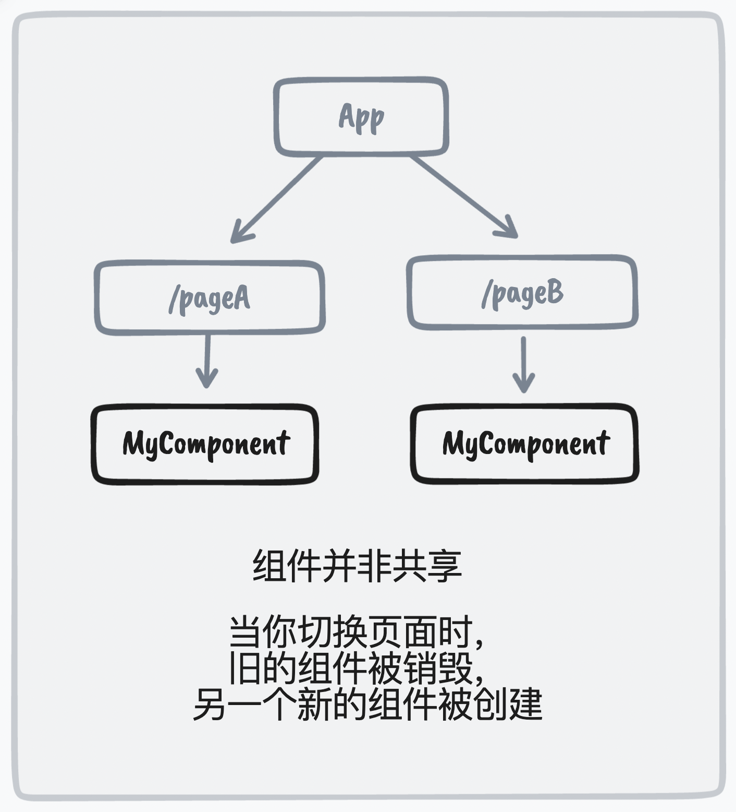

如果你在React项目中在多个路由中使用了同一个组件，在这几个路由切换的时候要求这个组件拥有平滑的过渡动画，同时在切换路由时能够保存这个组件的状态，那么这个项目能够帮你解决这个让人头疼的问题。

## 实现思路

我们经常会在在不同的路由（页面）上使用统一组件，但他们的位置和大小可以不尽相同。这时你可能会希望在用户进行路由跳转时，想让它们展示流畅的过渡动画。尽管这样的动画在原生应用中较为常见，但要在 Web 中实现却有一些挑战。

在React中虽然在不同的路由下使用了同一个组件，但是在切换路由时组件会卸载和重新挂载，相当于先销毁旧组件再创建一个新组件，那么组件内部的状态就会消失，这意味着当用户在路由之间跳转时，同样的组件并不会跨路由共享。



因为它们是两个不同的实例，这意味着你无法直接为它们的添加补间动画。幸运的是，有一种叫做 [FLIP](https://github.com/googlearchive/flipjs) 的技术可以模拟不同组件之间的过渡动画。


在FLIP中我们页面中的组件**只是一个代理组件**，用于**接收一些位置信息和一些props**。而真正要渲染的组件，其实是用**绝对定位悬浮在整个App下的**，根据代理组件接收到的位置和样式信息，将悬浮的真正组件通过补间动画的形式移动到对应的位置。

因此，FLIP 只解决了过渡的问题，我们仍然还是会有两个组件实例。在跳转过程中，组件的内部状态将会丢失。**解决方案**：等到补间动画结束之后，我们可以通过createPortal（vue中是teleport）将**组件传送到对应的代理组件中**


## demo

若想实现如下的效果：


首先使用`Starport`组件包裹整个`App`（`Startport`作用是提供全局状态，便于`FlowContainer`与`FlowProxy`之间的通信），并且包裹`FlowContainer`组件，在`FlowContainer`中用slot属性指定要渲染的内容。这里我们要渲染的是一个图片组件`TheImage`

> 注意：一定要给`Container`唯一的port字符串

```react
<Condition.Provider value={ConditionContext}>
      <ThemeProvider theme={theme[mode]}>
        <StartPort>
          <div>
            <Nav />
            <div className="App">{useRoutes(routes)}</div>
          </div>
          
          {imgs.map((img, index) => {
            return (
              <FlowContainer
                key={index}
                slot={<TheImage src={img} />}
                port={index + 1 + ""}
              />
            );
          })}
        </StartPort>
      </ThemeProvider>
</Condition.Provider>
```


接着，我们就可以在页面中使用`FlowProxy`组件来渲染`FlowContainer`组件的`slot`指定的内容了（渲染的时候`slot`外面会多一层`div`），如下。我们可以给`FloatProxy`传入一些`props`，他们会被挂载到`slot`外的`div`上（一般来说可以传入一些样式）。例如：在home界面（路由为：”/“）渲染12个共享的`TheImage`组件。

```react
const Home: FC<IProps> = () => {
  const { size, setSize } = useContext(Condition);
  return (
    <HomeContainerWraper>
      ...
      <div className="content">
        {["1", "2", "3", "4", "5", "6", "7", "8", "9", "10", "11", "12"].map(
          (item) => (
            <FlowProxy
              key={item}
              port={item}
              className={
                size ? "item w-15rem h-10rem m-2" : "item w-15rem h-12rem"
              }
            />
          )
        )}
      </div>
    </HomeContainerWraper>
  );
};
export default memo(Home);
```

渲染结果如下：


点击Toggle Size:


接着渲染另一个界面：`TransferList`（路由为：”/foo“），将12个共享的`TheImage`组件分成了ListA与ListB两列

```react
const TransferList: FC<IProps> = () => {
  const [listA, setListA] = useState(["1", "2", "3", "7", "8", "9"]);
  const [listB, setListB] = useState(["4", "5", "6", "10", "11", "12"]);
  return (
    <TransferListWraper>
      ...
      <div className={`flex m-0 m-auto w-1/2 justify-between`}>
        <div className={`w-2/5`}>
          <div className={`text-center m-4`}>
            <span className={`text-2xl spanWraper`}>List A</span>
          </div>

          {listA.map((item) => (
            <FlowProxy
              className={`rounded-4xl overflow-hidden h-12rem`}
              key={item}
              port={item}
            />
          ))}
        </div>
        <div className={`w-2/5`}>
          <div className={`text-center m-4`}>
            <span className={`text-2xl spanWraper`}>List B</span>
          </div>
          {listB.map((item) => (
            <FlowProxy
              key={item}
              port={item}
              className={`h-14rem`}
            />
          ))}
        </div>
      </div>
    </TransferListWraper>
  );
};

export default memo(TransferList);

```

渲染结果如下：


切换路由的时候（”/“ 切换到 ”/foo“），会有平滑的补间动画，如下所示：


细心的你可能会发现图片下方的数字，数字表示的是共享组件内部存储的状态，可见路由跳转时共享组件内部状态没有改变。

同时demo中实现了一些小功能，如：开启”debug“就可以提前在组件起飞后看到组件落地时的位置，还利用了styled-component实现了一键换肤。


